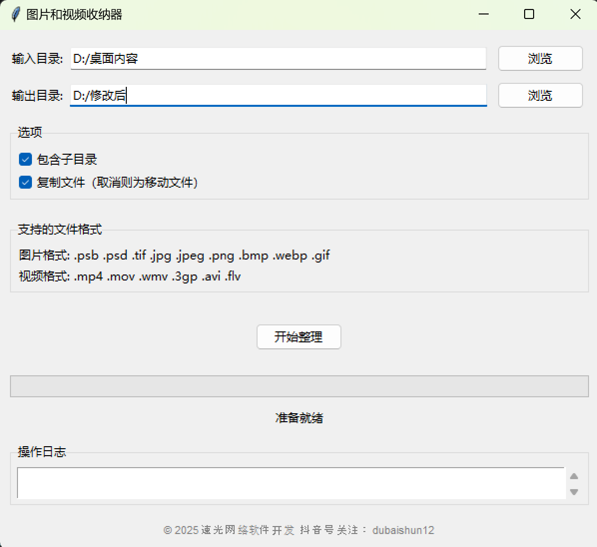

# 图片和视频收纳器

一个用Python编写的GUI应用程序，用于自动整理图片和视频文件。

## 功能特点

- **GUI界面**: 简洁易用的图形用户界面
- **自动分类**: 根据文件修改时间按年月分类（如：2025-09）
- **递归搜索**: 支持搜索子目录中的文件
- **多格式支持**: 支持常见的图片和视频格式
- **安全操作**: 支持复制或移动模式，避免数据丢失
- **实时进度**: 显示处理进度和详细日志
- **窗体居中**: 程序启动时自动居中显示
- **智能重名处理**: 自动处理文件名冲突

## 核心规范

### 文件格式规范
本程序严格按照以下格式规范进行文件识别和处理：

**图片格式**: `.psb .psd .tif .jpg .jpeg .png .bmp .webp .gif`
**视频格式**: `.mp4 .mov .wmv .3gp .avi .flv`

### 文件分类规范
- **时间分类**: 根据文件修改时间按年月分类
- **递归搜索**: 支持递归搜索所有子目录
- **目录命名**: 按照"年份-月份"格式创建目录（如：2025-09）

### 文件重名处理规范
当目标目录中存在同名文件时，程序会自动在文件名后添加数字后缀以避免覆盖：
```
vacation.jpg → vacation_1.jpg → vacation_2.jpg
```
以此类推，确保不会丢失任何文件。

## 技术栈

- **开发语言**: Python 3.6+
- **GUI框架**: tkinter（Python标准库）
- **文件操作**: os, shutil, pathlib
- **多线程**: threading（用于后台处理）


## 使用方法

### 方法一：直接运行Python文件
```bash
python image_video_organizer.py
```

### 方法二：使用批处理文件（推荐）
双击 `run.bat` 文件


## 输出结构

程序会在输出目录中创建按年月命名的文件夹：

```
输出目录/
├── 2025-01/    # 2025年1月的文件
├── 2025-02/    # 2025年2月的文件
├── 2025-09/    # 2025年9月的文件
└── 未知日期/    # 无法读取修改时间的文件
```





## 更新日志

### v1.0.0 (2025年9月10日)
- 初始版本发布
- 支持特定图片和视频格式（.psb .psd .tif .jpg .jpeg .png .bmp .webp .gif | .mp4 .mov .wmv .3gp .avi .flv）
- GUI界面设计，窗体居中显示
- 按文件修改时间自动分类（年月格式）
- 支持递归搜索子目录
- 复制/移动模式选择
- 智能文件重名处理（自动添加数字后缀）
- 实时进度显示和详细日志
- 多线程处理，不卡顷界面
- 版权信息和品牌标识


## 版权信息

© 2025 速光网络软件开发  抖音号关注：dubaishun12